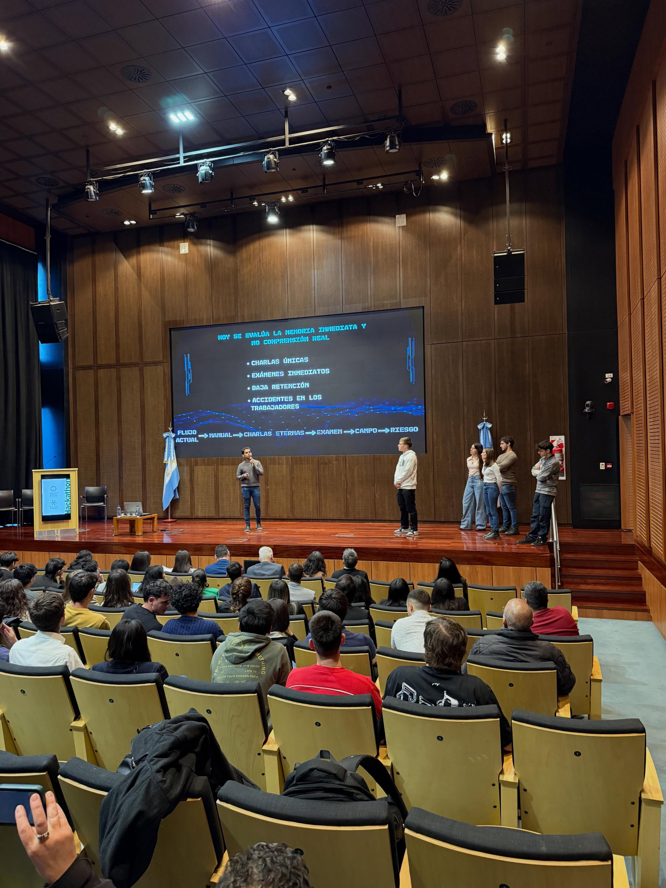

# Hackathon Minera 2026 - Reinvención del proceso de inducción en las mineras

Sistema de inducción minera inteligente en San Juan, Argentina. Reemplaza el proceso tradicional —manual impreso + charla de 8 horas— por un flujo de 4 etapas con VR, evaluación adaptativa y asistente IA disponible 24/7.

**Desafío Nº 8 · Hackathon Minera 2026 · Equipo Vector Mineral**

 

  

---

---

---

## Problema

La industria minera en San Juan enfrenta desafíos críticos en los procesos de inducción y capacitación de personal: tiempos elevados de formación, baja trazabilidad del aprendizaje, riesgos operativos en entornos reales y dificultad para evaluar situaciones críticas antes del ingreso a la mina.

## Solución

MinerIA propone una plataforma inteligente de inducción minera que combina simulaciones inmersivas en realidad virtual, automatización mediante inteligencia artificial y seguimiento centralizado del progreso de cada operario. El sistema permite capacitar, evaluar y detectar riesgos de manera más eficiente, segura y escalable para operaciones mineras en San Juan, Argentina.

---

## Flujo de inducción

| Etapa | Descripción | Requisito |
|-------|-------------|-----------|
| Charla introductoria | Presencial con instructor — normativa, mapa de instalaciones, reglas críticas | ~1 hora |
| Simulación VR | Meta Quest 2 — falla segura: situaciones de riesgo reales sin consecuencias físicas | Puntaje ≥ 70% |
| Examen obligatorio | Preguntas situacionales por rol y área, basadas en el Decreto 249/07 | 70% · máx. 3 intentos |
| Experto IA 24/7 | RAG sobre documentación técnica oficial · WhatsApp + web | Acceso permanente |

Sin aprobar cada etapa no se habilita la siguiente. Sin examen aprobado, no hay acceso a faena.

---

## Stack

**Backend** — NestJS · Prisma · PostgreSQL 16 + pgvector · Redis · MinIO  
**Frontend** — Next.js 14 App Router · TypeScript · TailwindCSS · TanStack Query · Framer Motion  
**IA** — GPT-4o · text-embedding-3-large (3072d) · Whisper  
**VR** — Meta Quest 2 · OpenXR SDK 60.0  
**Infra** — Docker Compose · Turborepo · GitHub Actions CI  

---

 *Equipo Vector Mineral · Hackathon Minera 2026*